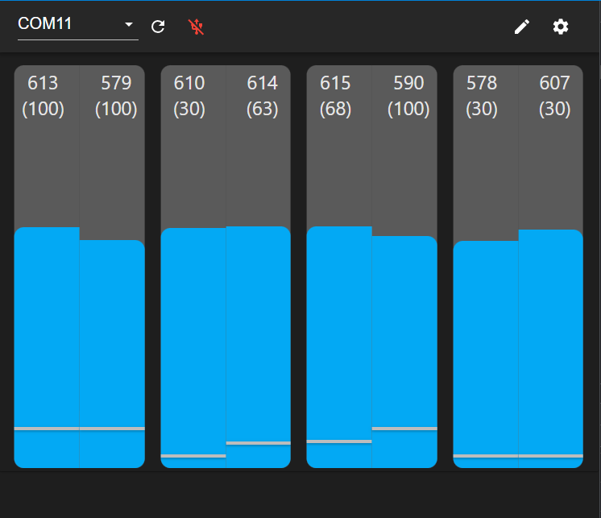

# Widgetpad Configurator

## Description

Configures a dance pad running [widgetpad-firmware](https://github.com/widget-/widgetpad-firmware) or similar. It is
currently in "very beta" status.

Built with Electron and React.

## Building / Running

Note: I haven't tried this on a clean setup yet.

* Install NodeJS 15 or later and npm.
* `git checkout` and `cd` into project folder.
* `npm i` to install dependencies
* To run both React webserver and Electron together:
    * `npm run dev`
* Or separately:
    * React webserver: `npm run start`
    * Electron: `npm run electron-no-wait`

## Roadmap / Todo

See the [project](https://github.com/widget-/widgetpad-configurator/projects/1) page

* Features
    * [x] Electron and React
    * [x] SerialPort connection handling
    * [x] Multiple port compatibility
    * [x] Edit thresholds
    * [x] Panel value and threshold UI
    * [x] Multiple sensors per panel
    * [x] Pad settings page
    * [ ] Save configuration to file (can be used as profiles)
    * [ ] Save pad settings to on-device storage
    * [ ] App settings page

* Code quality
    * [x] Use Redux
    * [ ] Use react-router (may be unneccessary)
    * [ ] Convert JS to Typescript
    * [ ] Overdocument everything
    * [ ] Find all unused leftover modules that `create-react-app` left me
